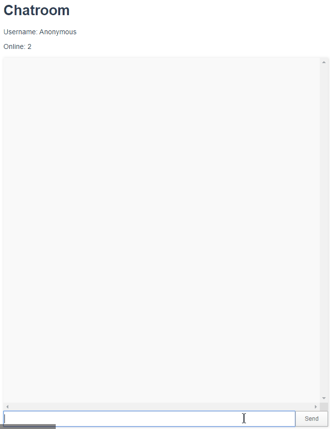

# Chat App

### NodeJS, VueJS, SocketIO



<br/>

## Node

1. > npm init

   - starts a new Node Application

2. package.json

   - ```json
     "dependencies": {
         "express": "*",
         "socket.io": "*"
     }
     "devDependencies": {
         "nodemon": "*"
     }
     ```

3. > npm install

4. server.js

   - ```javascript
     // import app from "express";
     const app = require("express")();
     // do not need to npm install, it is already in NodeJS
     const http = require("http").Server(app);
     const io = require("socket.io")(http);

     const PATH = process.env.PORT || 3000;

     http.listen(PATH, () => {
       console.log("Listening on port %s", PATH);
     });
     ```

5. > npm run dev

   - "Listening on port 3000"

6. io.on("connection") > [tutorialsPoint_socketio](https://www.tutorialspoint.com/socket.io/index.htm)
   - socket.emit("loggedIn")
   - socket.on("newuser")
     - io.emit("userOnline")
   - socket.on("msg")
     - io.emit("msg")
   - socket.on("disconnect")
     - io.emit("userLeft")

<br/>

## Vue

1. > vue ui

   - create new project
   - install **socket.io-client**

   - install **node-sass**, **sass-loader**
   - run serve

2. client/

- delete Helloworld.vue

- modify App.vue

  - reset style

  - ```javascript
    // connect with NodeJS
    socket: io("http://localhost:3000"),
    ```

  - mounted = as soon as code gets mounted to the DOM, run

  - ```javascript
    this.socket.on("loggedIn", data => {
      //...
      this.socket.emit("newuser", this.username);
    });
    ```

  - on = standby for a event to trigger

  - emit = broadcast an event

  - Add event listeners

    - ```javascript
      listen: function () {
      	this.socket.on('userOnline', user => {
      	this.users.push(user);
      });
      }
      ```

- create ChatRoom.vue

  - ```javascript
    v-on:click="something" ----> v-on:submit="something"
    ```

  - ```javascript
    // Vue emit
    this.$emit("sendMessage");
    ```

  - scss

    - flex: 1 => cover whole page

- App.vue

  - create sendMessage function
